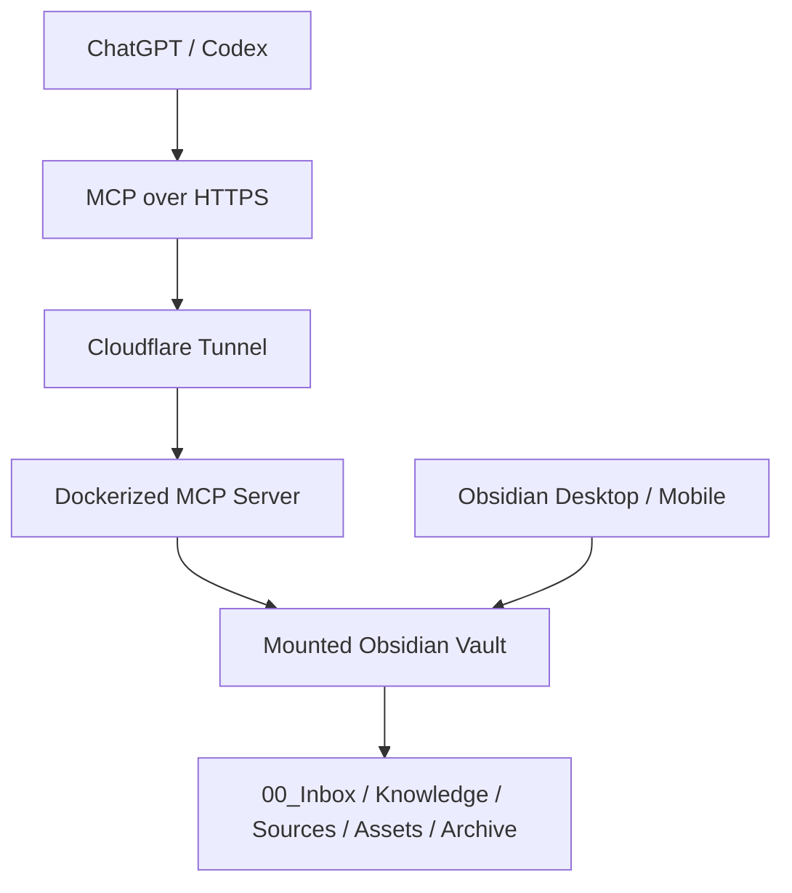

# Obsidian-MCP

一个面向个人知识库工作流的 MCP server，允许 ChatGPT / Codex 直接读写 Obsidian Markdown vault。它的目标不是“远程控制 Obsidian App”，而是把 AI 产出的高价值内容沉淀成可检索、可确认、可更新、可归档、可回滚的 Markdown 知识库。

当前实现以 `Synology NAS + Docker + Cloudflare Tunnel + Obsidian Vault` 为主要部署模型，服务端直接操作挂载的 vault，不要求桌面端 Obsidian 常开。

## Why This Project Exists

很多 “Obsidian + AI” 方案默认依赖下面几件事：

- Obsidian desktop app 必须在线
- 本地 REST plugin 必须在线
- AI 只是把聊天内容存起来，而不是形成可维护的知识资产

这个项目选择了另一条路线：

- 直接操作 vault 里的 Markdown 文件
- 把 `Inbox -> Knowledge -> Archive/Versions -> Archive/Deleted` 做成显式生命周期
- 让 ChatGPT / Codex 能围绕同一套知识库进行写入、检索、更新和回滚
- 把图片、截图、PDF 一起纳入 Obsidian 的 `Assets` 目录

核心目标是把高价值对话变成长期可读、可复用、可演进的个人 knowledge base，而不是单纯保存聊天记录。

## What It Does

当前仓库里的 MCP server 提供了几类核心能力：

- Draft workflow
  - `create_inbox_note`
  - `create_inbox_note_with_attachments`
  - `list_inbox`
  - `fetch_inbox_note`
  - `replace_inbox_note`
  - `append_inbox_note`
  - `archive_inbox_note`
- Knowledge lifecycle
  - `promote_inbox_note`
  - `update_knowledge_note`
  - `append_knowledge_note`
  - `archive_knowledge_note`
  - `list_versions`
  - `fetch_version`
  - `rollback_knowledge_note`
- Search and retrieval
  - `search_notes`
  - `fetch_note`
- Source capture and attachments
  - `capture_source_note`
  - `save_attachment_from_url`
  - `save_attachment_base64`
- Service health
  - `health_check`
  - `GET /health`

## Architecture



这个仓库里的 Web app 使用：

- `FastMCP` 暴露 MCP tools
- `Starlette` 暴露 `/health` 和 MCP HTTP app
- `TransportSecuritySettings` 做 host/origin 限制
- `CORSMiddleware` 允许跨源请求

默认运行逻辑：

- vault 根目录来自 `VAULT_ROOT`，默认 `/vault`
- 公网 host 来自 `PUBLIC_HOST`
- 所有业务时间戳统一使用 `Asia/Shanghai`
- 启动时会确保 `Inbox / Knowledge / Sources / Templates / Assets / Archive` 等目录存在

## Vault Layout

服务假定 vault 内至少有如下结构；缺失目录会在运行时自动创建：

```text
Obsidian/
  00_Inbox/
    ChatGPT_To_Process/
    Capture/
  Knowledge/
  Sources/
  Templates/
  Assets/
    ChatGPT/
      YYYY-MM/
  Archive/
    Versions/
    Deleted/
      Inbox/
```

这些目录的职责是：

- `00_Inbox/ChatGPT_To_Process`
  - AI 先写草稿，用户审阅后再晋升为正式知识
- `00_Inbox/Capture`
  - 收外部资料、网页摘要、截图型原始来源
- `Knowledge`
  - 默认检索面，保存已确认的正式知识
- `Sources`
  - 保留来源材料和上下文
- `Templates`
  - 放模板化笔记
- `Assets/ChatGPT/YYYY-MM`
  - 放图片、截图、PDF 等附件
- `Archive/Versions`
  - 保存 Knowledge 更新前的旧版本
- `Archive/Deleted`
  - 保存软归档/软删除内容，不做物理删除

## Typical Workflow

这个项目想解决的是一条完整的 knowledge workflow：

1. 用户让 AI “总结，归档”
2. AI 调用 `create_inbox_note` 把草稿写进 `00_Inbox/ChatGPT_To_Process`
3. 用户审阅草稿后说“确认”
4. AI 调用 `promote_inbox_note` 晋升到 `Knowledge/<subdir>`
5. 之后如果知识更新：
   - 结论型内容用 `update_knowledge_note`
   - 日志型内容用 `append_knowledge_note`
6. 每次更新都会先把当前版本保存到 `Archive/Versions`
7. 如果当前版本有误，可以用 `rollback_knowledge_note` 从历史版本恢复

附件和来源采集也在这条链路里：

- 远程图片/PDF 用 `save_attachment_from_url`
- base64 图片/PDF 用 `save_attachment_base64`
- 外部资料采集用 `capture_source_note`
- 图文草稿可直接用 `create_inbox_note_with_attachments`

## Deployment

### Prerequisites

- Python 3.12+
- 一个可读写的 Obsidian vault
- 如果要公网接入：反向代理或 tunnel，例如 Cloudflare Tunnel
- 推荐容器化部署，尤其是 NAS 场景

### Run Locally

如果你只是想在本地验证 MCP server：

```bash
python3 -m venv .venv
source .venv/bin/activate
pip install -r requirements.txt
VAULT_ROOT=/absolute/path/to/your/vault \
PUBLIC_HOST=localhost \
uvicorn app:app --host 0.0.0.0 --port 8000
```

启动后可检查：

- Health endpoint: `http://127.0.0.1:8000/health`
- MCP endpoint: `http://127.0.0.1:8000/mcp`

### Run with Docker

当前 `Dockerfile` 使用 `python:3.12-slim`，安装依赖后直接运行：

```bash
uvicorn app:app --host 0.0.0.0 --port 8000
```

一个最小容器运行示例：

```bash
docker build -t obsidian-mcp .
docker run --rm -p 8000:8000 \
  -e VAULT_ROOT=/vault \
  -e PUBLIC_HOST=localhost \
  -v /absolute/path/to/your/vault:/vault \
  obsidian-mcp
```

### About `compose.yaml`

仓库中的 [`compose.yaml`](./compose.yaml) 反映的是一套 NAS 部署布局，而不是“直接 clone 当前 repo 后立刻可用”的布局。它目前假定：

- `docker-compose.yml` 位于部署目录根部
- 运行文件位于 `./obsidian-mcp-app/`
- vault 会被挂载到 `/vault`
- Cloudflare Tunnel 负责把容器服务暴露为 HTTPS

如果你直接在当前 repo 根目录运行 compose，需要二选一：

1. 把 `build: ./obsidian-mcp-app` 改成 `build: .`
2. 按它预期的方式，把 `app.py`、`Dockerfile`、`requirements.txt` 放进 `obsidian-mcp-app/` 子目录

当前仓库已经把 Tunnel token 改成通过环境变量注入。建议在本地创建 `.env`，不要提交真实值；可以参考 [`.env.example`](./.env.example)。

## Configuration

主要环境变量如下：

| Variable | Default | Meaning |
| --- | --- | --- |
| `HOST_VAULT_PATH` | `/volume1/Obsidian` | Host 侧 Obsidian vault 路径，供 `compose.yaml` 挂载使用 |
| `VAULT_ROOT` | `/vault` | Obsidian vault 挂载点 |
| `PUBLIC_HOST` | `obsidian-mcp.example.com` in `compose.yaml` | 对外访问 host，用于 transport security |
| `MAX_CONTENT_BYTES` | `300000` | 单篇 Markdown 内容大小上限 |
| `MAX_ATTACHMENT_BYTES` | `15000000` | 单个附件大小上限 |
| `CLOUDFLARE_TUNNEL_TOKEN` | required | Cloudflare Tunnel token，只应通过环境变量或 `.env` 提供 |

## Search, Archive, and Rollback Model

这个项目有几个比较重要的行为边界：

- `search_notes` 默认只查 `Knowledge`
- `scope` 支持 `Knowledge`、`Sources`、`Templates`、`Inbox`、`All`、`Archive`
- `fetch_note` 允许读取受限目录中的 Markdown 文件
- `update_knowledge_note` / `append_knowledge_note` 写入前会自动归档旧版本
- `archive_inbox_note` 和 `archive_knowledge_note` 都是软归档，不是物理删除
- `rollback_knowledge_note` 会先归档当前版，再恢复指定历史版本

这意味着它不是“文件 CRUD server”，而是一个带 lifecycle 约束的 knowledge-base MCP。

## Example Use Cases

适合的使用场景包括：

- Troubleshooting 复盘
- Workflow / SOP 沉淀
- Concept 解释和术语卡片
- Decision record
- External source capture
- 带截图的图文知识卡

一个典型的用户交互可以是：

- “总结，归档”
- “给这篇草稿补充一段”
- “确认，放到 Workflows”
- “查一下我之前有没有类似记录”
- “更新这篇，保留旧版本”
- “把这篇知识卡归档”
- “回滚这篇知识卡”

## HTTP Endpoints

当前 Web app 暴露两个关键入口：

- `GET /health`
  - 返回版本、时区、vault 路径、公共 host 和目录状态
- `/mcp`
  - 由 `FastMCP` 的 streamable HTTP app 处理

## Safety Model and Current Limits

当前实现是一个业务闭环优先的版本，特点是：

- 当前为 `no-auth` 模式
- 不允许访问 vault 外路径
- 不允许写入 `.obsidian`
- 不提供物理删除
- 附件仅允许 image / PDF
- 默认时间戳统一为 `Asia/Shanghai`

这意味着它更适合：

- 自用环境
- 家庭实验室 / NAS
- 已经有外层网络控制的部署

如果你要更广泛开放访问，建议把认证、secret 管理、rate limiting、外层访问控制一起补上。

## Repository Contents

当前仓库很小，核心文件只有：

- [`app.py`](./app.py)
  - MCP tools、路径约束、生命周期逻辑、HTTP app
- [`requirements.txt`](./requirements.txt)
  - Python 依赖
- [`Dockerfile`](./Dockerfile)
  - 镜像构建方式
- [`compose.yaml`](./compose.yaml)
  - NAS + cloudflared 部署示例

## Summary

`Obsidian-MCP` 不是一个通用文件服务器，也不是 Obsidian App 的远程控制器。它更像一个围绕 Obsidian vault 构建的 workflow-focused MCP service：

- 让 AI 直接把高价值对话写入 Markdown vault
- 用 Inbox / Knowledge / Archive 管理知识生命周期
- 保留附件、版本历史和回滚能力
- 让 ChatGPT / Codex 和 Obsidian 围绕同一份知识资产协作
